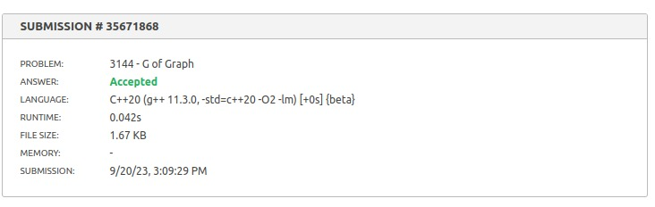
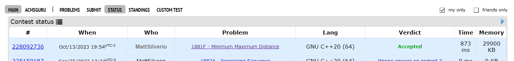
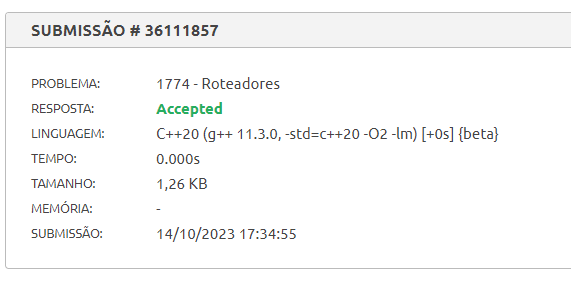
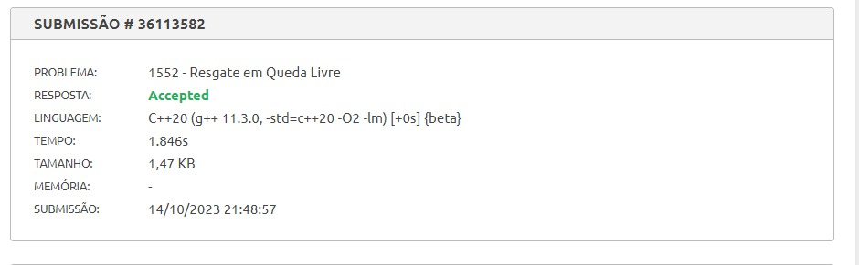

# Exercícios Resolvidos

**Conteúdo da Disciplina**: Grafos 2 

## Alunos
|Matrícula | Aluno |
| -- | -- |
| 15/0154348  | Matheus Phillipo Silverio Silva |
| 19/0134810  |  Shaíne Aparecida Cardoso de Oliveira |

## Sobre 
O repositório contém soluções para algumas questões de juíz online do AtCoder, Codeforces e BeeCrowd

- [G de grafo](https://www.beecrowd.com.br/judge/en/problems/view/3144)
- [Minimum Maximum Distance](https://codeforces.com/problemset/problem/1881/F)
- [Resgate em Queda Livre](https://www.beecrowd.com.br/judge/en/problems/view/1552)
- [Roteadores](https://www.beecrowd.com.br/judge/pt/problems/view/1774)

## Screenshots

- G de grafo

- Minimum and maximum Distance
  

- Roteadores
  

- Resgate em Queda Livre

## Apresentações

**Para maior conforto, as apresentações estão no youtube. Mas caso não consiga acessa-las, os vídeos se encontram na pasta [apresentacoes](https://github.com/projeto-de-algoritmos/Grafos2_ExerciciosJuizOnline/tree/master/apresentacoes).**

- [Apresentação dos problemas Minimun And Maximum Distance](https://www.youtube.com/watch?v=pCcjbO8UTr4)
- [Apresentação dos problemas G_grafo e Resgate em Queda Livre](https://youtu.be/6qRsmQkskuQ)

## Instalação 
**Linguagem**: C++ 

## Uso 
Para rodar os algoritmos deste repositório, siga as etapas abaixo:

- Certifique-se de ter um compilador para C++ instalado em sua máquina, recomendamos o g++.
- Faça o clone do repositório Git para o seu ambiente local.
- Compile o arquivo desejado com `g++ -o <nome-do_executavel> <nome-do-arquivo.cpp>`
- Execute o arquivo com `./<nome-do-executavel>`. Certifique-se de que esteja no diretório correto em seu terminal para executar os comandos acima.
- Opcional: Deixamos os arquivos de entrada dos casos de testes de exemplo dos problemas em cada problema, afim de reduzir o tempo de digitação. Ao executar o programa, execute `./<nome-do-executavel> < <nome-do-arquivo-de-input>.txt`
